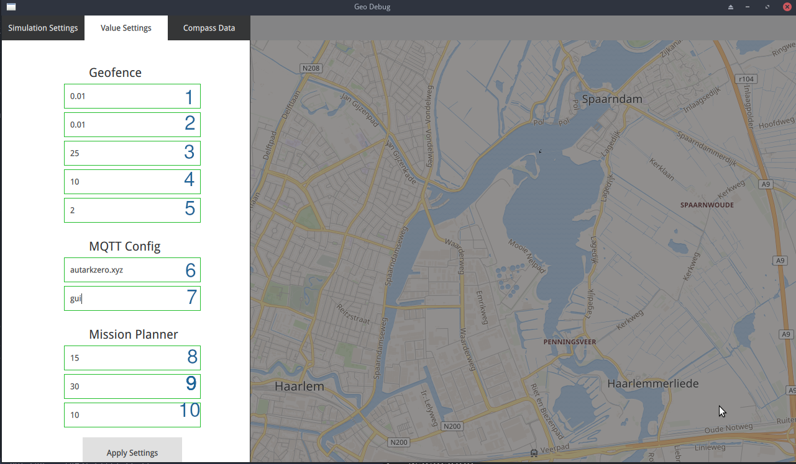

GUI Explanation and Walkthrough
===============================
In this section an overview of the Qt application is given together
with examples on how the software can be used.

Implementation of the GUI
-----------------------------
Most of the GUI is implemented in the `Qt Markup Language <https://doc.qt.io/qt-5/qtqml-index.html>`_ which is an
API on top of `Qt <https://qt.io/>`_ and `Qt Quick <https://wiki.qt.io/Qt_Quick>`_. It allows for the quick designing of
GUI applications in a nice easy to read format which is perfect for
source control systems like git. There are, as far as we are aware, no
good designer tools which are free. However the Qt Company does
provide a cool looking designer.

The GUI is entirely based on crossplatform *desktop* user interface
technologies such as X11 or Wayland on Windows. Using it the web
through webassembly is untested as of June 2021 and there is a decent
chance that it will not work.

Current Features
---------------------------
As of June 2021 the GUI supports debugging various part of project,
mainly the geofence and the path finding modules. The configuration
file can in parts be modified in the GUI and those changes are
dynamically reflected in the program.

The features are:

- Generating geofences at arbitrary locations
- Setting destination for the path finding algorithm
- Displaying the area around the yacht
- Configuration where parameters can be optimized.
- Get the geofence around the current location
- Show an example mission

UI Walkthough
-------------

The UI consists out of four parts: the map with the mission simulation
(1), a context menu which can be used for debugging at specific
locations (2), a menu bar with a limited set of options (3) and a
settings menu (4). It supports both it being run on a desktop or a
mobile phone. Accessing the settings menu can be done by dragging the
right side of the screen to the left.

When opening the GUI there are three pages, two of which have been
implemented. First of these is a settings page which allows you change
the paremeters of GUI internal features which currently is just the
simulation. The amplitude changes the direction of the example mission
and the speed changes how fast the simulations goes.

Second page allows you to set some of the values which are defined in
the configuration file. In order to keep the screen from being too
crowded, we have chosen to only display the most relevant parameters
which may need to optimised or could be changed while the program is
running. Think of the simplification done on the Polygons, the delta
of the bounding box around the boat or the MQTT settings. Labels for
these values are missing. An overview of settings is given below and
you can find an explanation of all values in the relevant chapter.
Before the changes take into effect, the *Apply Settings* button needs
to be pressed.

**An Overview of the configuration settings:**

1. Latitude delta for the Geofence bounding box
2. Longitude delta for the Geofence bounding box
3. Minimum distance required before the Geofence regenerates
4. Time until the Geofence refreshes.
5. Maximum distance difference from the original polygon for each
   distance
6. Broker server name
7. MQTT client name
8. Amount of waypoints the mission planner can generate in one go.
9. Minimum distance between waypoints
10. Angle the boat should go at when it changes direction.
